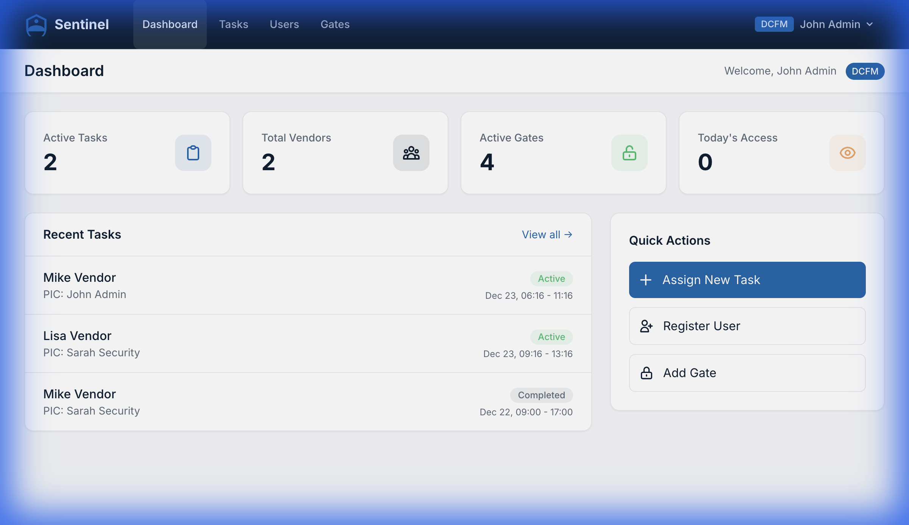

<div align="center">
  
  
  # Sentinel
  
  **Data Center Escort Access Control System**
  
  [](https://laravel.com)
  [](https://tailwindcss.com)
  [](LICENSE)
</div>

---

## Overview

Sentinel is an internal web application designed to enforce **vendor escort compliance** within secure data center environments. It ensures that vendors are always accompanied by their assigned PIC (Person in Charge) when accessing restricted gates.

### Key Features

- 🔐 **Pair-based Access Control** — Vendors can only access gates with their assigned PIC present
- 👥 **Role-based Access** — Three roles: Vendor, DCFM (Facility Manager), SOC (Security)
- 🚪 **Gate Management** — Configure and monitor access points
- 📋 **Task Assignment** — Create time-bound vendor visits with specific gate permissions
- 📊 **Audit Logging** — Complete trail of all access attempts
- 🤖 **IoT Integration** — REST API for face-scanning devices

---

## Quick Start

### Requirements

- PHP 8.2+
- Composer 2.x
- Node.js 18+
- SQLite (default) or MySQL/PostgreSQL

### Installation

```bash
# Clone the repository
git clone https://github.com/your-org/sentinel.git
cd sentinel

# Install dependencies
composer install
npm install

# Configure environment
cp .env.example .env
php artisan key:generate

# Setup database
php artisan migrate --seed

# Build assets
npm run build

# Start server
php artisan serve
```

### Default Accounts

| Role | Email | Password |
|------|-------|----------|
| DCFM (Admin) | admin@sentinel.com | password |
| SOC (Security) | soc@sentinel.com | password |
| Vendor | vendor1@example.com | password |

---

## Documentation

| Document | Description |
|----------|-------------|
| [Architecture](docs/architecture.md) | System design and components |
| [API Reference](docs/api.md) | IoT integration endpoints |
| [User Guide](docs/user-guide.md) | How to use Sentinel |
| [Deployment](docs/deployment.md) | Production setup guide |

---

## IoT Integration

Sentinel provides a REST API for face-scanning IoT devices at gates:

```http
POST /api/access/validate
Content-Type: application/json

{
  "vendor_face_id": "VENDOR-UUID",
  "pic_face_id": "PIC-UUID",
  "gate_id": "GATE-MAIN-001"
}
```

**Response:**
```json
{
  "approved": true,
  "reason": "OK"
}
```

See [API Documentation](docs/api.md) for details.

---

## Tech Stack

- **Backend:** Laravel 12, PHP 8.2
- **Frontend:** Blade, Tailwind CSS, Vite
- **Database:** SQLite (dev) / MySQL (prod)
- **Auth:** Laravel Breeze

---

## Screenshots

<div align="center">
  
  <p><em>Bento-style Dashboard</em></p>
</div>

---

## Contributing

1. Fork the repository
2. Create a feature branch (`git checkout -b feature/amazing`)
3. Commit changes (`git commit -m 'Add amazing feature'`)
4. Push to branch (`git push origin feature/amazing`)
5. Open a Pull Request

---

## License

This project is licensed under the MIT License - see the [LICENSE](LICENSE) file for details.

---

<div align="center">
  <sub>Built with ❤️ for secure data center operations</sub>
</div>
