<div align="center">
  
  
  # Sentinel
  
  **Data Center Escort Access Control System**
  
  [](https://laravel.com)
  [](https://fastapi.tiangolo.com)
  [](LICENSE)
</div>

---

## Overview

Sentinel is an **IoT Access Control System** for secure data center environments. It enforces vendor escort compliance, ensuring vendors are always accompanied by their assigned PIC (Person in Charge).

### Architecture

This monorepo contains four components:

| Folder | Description | Tech Stack |
|--------|-------------|------------|
| [`/web`](web/) | Dashboard & Admin Panel | Laravel 12, Tailwind CSS |
| [`/server`](server/) | Access Control API | FastAPI, Python 3.11+ |
| [`/client`](client/) | Face Recognition Client | Python, InsightFace, Tkinter |
| [`/solenoid`](solenoid/) | Door Lock IoT Actuator | ESP8266, Arduino |

### System Architecture

```mermaid
flowchart TB
    subgraph Frontend["🖥️ Frontend"]
        WEB["Web Dashboard<br/>(Laravel + Tailwind)"]
    end

    subgraph Backend["⚙️ Backend Services"]
        API["FastAPI Server<br/>(Python)"]
        DB[("MySQL<br/>Database")]
    end

    subgraph IoT["📡 IoT Devices"]
        CLIENT["Face Recognition Client<br/>(InsightFace + Tkinter)"]
        ESP["ESP8266 Solenoid<br/>(Door Lock)"]
        CAM["📷 Webcam"]
    end

    WEB <-->|"HTTP API"| API
    API <-->|"SQLAlchemy"| DB
    
    CLIENT -->|"Enroll/Verify Face"| API
    CAM -->|"Video Feed"| CLIENT
    
    API -->|"Unlock/Lock Commands"| ESP
    
    WEB -->|"User Management<br/>Task Assignment"| DB
    
    style WEB fill:#FF2D20,color:#fff
    style API fill:#009688,color:#fff
    style DB fill:#00758F,color:#fff
    style CLIENT fill:#306998,color:#fff
    style ESP fill:#00979D,color:#fff
```



### Access Flow

```mermaid
sequenceDiagram
    participant V as Vendor
    participant C as Client (Camera)
    participant S as FastAPI Server
    participant P as PIC
    participant D as Door Lock (ESP8266)

    V->>C: Face detected
    C->>S: Send embedding
    S->>S: Identify vendor
    S-->>C: Waiting for PIC
    
    P->>C: Face detected
    C->>S: Send embedding
    S->>S: Validate PIC + Vendor match
    S->>D: POST /unlock
    D->>D: Energize relay
    S-->>C: ✅ Access Granted
    
    Note over S: Wait X seconds...
    
    S->>D: POST /lock
    D->>D: De-energize relay
```



---

## Screenshots

### Dashboard
Real-time overview of active tasks, gate status, and recent activity.


### User Management
Manage users, vendors, and security personnel.


### Tasks
Monitor access tasks and their status.


### User Enrollment (Webcam Support)
Register users with live webcam capture and auto-generated credentials.


### Face Approval
Admin approval workflow for vendor face enrollment.


---

## Quick Start

### 1. Web Dashboard (Laravel)

```bash
cd web
composer install && npm install
cp .env.example .env && php artisan key:generate
php artisan migrate --seed
composer run dev
```

### 2. API Server (FastAPI)

```bash
cd server
python3.11 -m venv venv && source venv/bin/activate
pip install -r requirements.txt
uvicorn main:app --reload --port 8002
```

### 3. Face Recognition Client

```bash
cd client
./run_client.sh
```

> **Note:** Requires Python 3.11 and `python-tk@3.11` on macOS.

---

## Documentation

| Document | Description |
|----------|-------------|
| [Web README](web/README.md) | Laravel dashboard setup |
| [Server README](server/README.md) | FastAPI backend details |
| [Client README](client/README.md) | Face recognition client |
| [API Reference](docs/api.md) | IoT integration endpoints |

---

## License

MIT License - see [LICENSE](LICENSE) for details.

<div align="center">
  <sub>Built with ❤️ for secure data center operations</sub>
</div>
